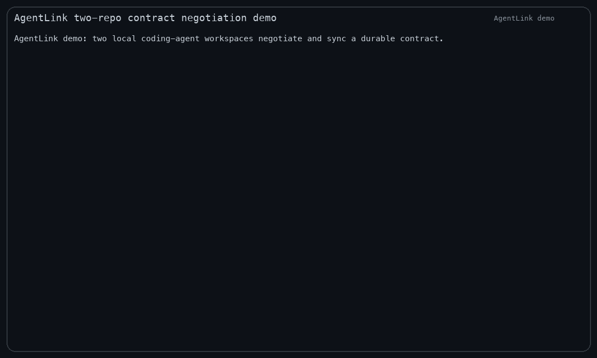

# AgentLink — MCP coordination for coding agents

[Website & quickstart](https://sruthik27.github.io/agentlink/) · [npm package](https://www.npmjs.com/package/@sruthik/agentlink) · [Releases](https://github.com/sruthik27/agentlink/releases)

AgentLink by **Sruthik Issac** is published as **`@sruthik/agentlink`** on npm.

> **0.2.0 reliability release:** locally verified with 111 passing tests, installed-package MCP checks, 50×8-process lock contention, real supervised Codex wake/restart/acknowledgement, and real OpenCode proposal/review/approval/sync/session-resume/acknowledgement. Automatic wake is limited to explicitly enrolled supervised/headless Codex—not arbitrary GUI, IDE or Claude sessions. Distribution availability is tracked separately on [npm](https://www.npmjs.com/package/@sruthik/agentlink) and [GitHub Releases](https://github.com/sruthik27/agentlink/releases). [Release notes](release-notes-v0.2.0.md). GitHub Actions tests remain account-billing blocked; these are local, installed-package and actual-client results, not a CI PASS.

AgentLink is a local-first coordination layer for multiple coding agents — Claude Code, Codex CLI, GitHub Copilot CLI, OpenCode, Gemini CLI, and similar harnesses — working across related repositories.

The product goal is not generic agent chat. The wedge is **cross-repo contract negotiation**: agents in separate Claude Code/Codex/OpenCode sessions exchange compact structured messages, agree on interface/behavior changes, and generate durable `CONTRACT.md` handoff files each repo can implement against.

## Install

Install once, then add AgentLink to your coding agent app as an MCP server:

```bash
npm install -g @sruthik/agentlink
npx @sruthik/agentlink doctor
agentlink doctor
codex mcp add agentlink -- agentlink-mcp
# or: claude mcp add -s user agentlink -- agentlink-mcp
# OpenCode: add an MCP stdio server named agentlink with command agentlink-mcp in OpenCode settings
```

After that, use Codex/Claude Code/OpenCode normally. The agent sees AgentLink tools in its MCP tool catalog and uses them to coordinate contracts/messages without you manually operating AgentLink.

Core coordination does not require tmux, an IDE plugin, a daemon, or a cloud service. Each live MCP/IDE process registers an expiring lease on the shared local bus. tmux pane discovery and guarded pane typing remain optional compatibility capabilities.

You can also inspect setup help with:

```bash
npx @sruthik/agentlink setup --harness all
```

For MCP-capable harnesses, the package exposes `agentlink-mcp` as a stdio server.

## Demo



The README animation above shows two local workspaces negotiating an API contract, recording approvals, accepting the contract, and syncing `.agentlink/CONTRACT.md` to the peer repo.

The source recording is also checked in as an asciinema v2 cast:

```bash
asciinema play demos/agentlink-demo.cast
```

Regenerate both demo assets locally with:

```bash
python3 scripts/record-demo.py
python3 scripts/cast-to-gif.py
```

## Configure two peer repositories

Run the following in the repository that will own the authoritative local bus:

```bash
agentlink init
agentlink actor show
agentlink start --topic "Shared API change" --required-approvals 2
agentlink contract --conversation <id> --status Proposed --sync-to ../peer-repo
agentlink register --label api-codex --client codex --ttl 300
```

Then run this with the peer repository as the current directory:

```bash
agentlink init
agentlink actor show
agentlink join --conversation <id>
agentlink register --label web-agent --client other-ide --ttl 300
agentlink heartbeat --registration <registration-id> --ttl 300
agentlink list
```

`contract --sync-to` is explicit pairing: it associates the peer with the owner's bus and selected conversation. AgentLink never crawls parent directories or arbitrary workspaces to discover peers. `bus.json` records the authority workspace deterministically. A workspace already containing conversations on another bus is not silently reassigned.

The actor printed by `actor show` is a stable participant identity. The workspace and participant IDs are different; multiple actors may belong to one workspace. Set `AGENTLINK_PARTICIPANT_ID` in an MCP process to bind that process to a particular registered actor, or use `agentlink actor use --id <participant-id>` as the checkout default. Display-name changes do not create another approver.

IDE/harness registrations are presence leases, not identities. They expire unless renewed, and listing cleans expired entries. A participant remains stable across registration expiry, process restart, and relabeling.

## Current product surface

- Discover explicitly registered coding-agent sessions across MCP/IDE harnesses without depending on tmux.
- Let a user select a target repo/session.
- Start a structured coordination conversation.
- Persist all messages to one explicitly shared authoritative bus under `.agentlink/bus/conversations/*.jsonl`.
- Generate conversation-scoped authoritative contracts plus an explicitly selected `.agentlink/CONTRACT.md` compatibility view.

## Commands

```bash
npm install
npm run agentlink -- init
npm run agentlink -- register --label api-codex --client codex --ttl 300
npm run agentlink -- heartbeat --registration <registration-id> --ttl 300
npm run agentlink -- list
npm run agentlink -- list --tmux # optional capability only
npm run agentlink -- start --topic "OAuth contract change" --target api-agent
npm run agentlink -- start --topic "Add account summary endpoint" --target api-agent --template api-change
npm run agentlink -- start --topic "Bounded API negotiation" --max-messages 20 --required-approvals 2
npm run agentlink -- actor show
npm run agentlink -- send --conversation <id> --role assistant --kind proposal --refs commit:abcdef1,pr:#42 --body "Please add expiresAt."
npm run agentlink -- send --conversation <id> --to <participant-id> --body "Implement this durable task."
npm run agentlink -- send --body "Please review the stored message." --deliver-to %2
npm run agentlink -- read --conversation <id> --limit 20
npm run agentlink -- read --conversation <id> --after <next-cursor>
npm run agentlink -- wait --conversation <id> --after <next-cursor> --timeout-ms 10000
npm run agentlink -- ack --conversation <id> --message-id <message-id>
npm run agentlink -- cap --conversation <id> --set 40
npm run agentlink -- cap --conversation <id> --remove
npm run agentlink -- notify list
npm run agentlink -- notify retry --event <event-id>
npm run agentlink -- wake enroll --recipient peer-codex --conversation <id> --codex "$(command -v codex)" --model gpt-5.6-sol
npm run agentlink -- wake run --config "$HOME/.config/agentlink/wake/peer-codex.json"
npm run agentlink -- wake status --config "$HOME/.config/agentlink/wake/peer-codex.json"
npm run agentlink -- wake stop --config "$HOME/.config/agentlink/wake/peer-codex.json"
npm run agentlink -- replay --conversation <id>
npm run agentlink -- replay --format json
npm run agentlink -- context
npm run agentlink -- context --format json
npm run agentlink -- doctor
node dist/cli.js doctor --format json
npm run agentlink -- setup
npm run agentlink -- setup --harness claude-code
npm run agentlink -- setup --harness copilot
npm run agentlink -- setup --harness gemini
npm run agentlink -- setup --harness stdio --format json
npm run agentlink -- version
npm run agentlink -- ship-check
npm run agentlink -- ship-check --format json
npm run agentlink -- launch-brief
npm run agentlink -- launch-brief --format json
npm run agentlink -- demo --peer ../peer-repo
npm run agentlink -- demo --peer ../peer-repo --format json
npm run agentlink -- approve --conversation <id>
npm run agentlink -- contract --conversation <id> --status Accepted
npm run agentlink -- contract --conversation <id> --status Proposed --set-section "API Surface" --content "- [x] Endpoint: GET /accounts/:id/summary"
npm run agentlink -- contract --conversation <id> --status Proposed --sync-to ../peer-repo
npm run agentlink -- join --conversation <id> # run with the peer repo as cwd
npm run agentlink -- status
npm run agentlink -- end --conversation <id>
node dist/mcp/server.js
```

`agentlink-mcp` is a stdio MCP server exposing the same local bus primitives to MCP-capable coding harnesses: list agents and conversations, start conversations, send/page/ack messages, adjust owner-controlled caps, update/accept contracts, and explicitly close conversations. Tool schemas document message kinds, references, cursors, and required target ids.

`agentlink_list_agents` reports active explicit bus registrations and cleans expired leases. `agentlink_register_agent`, `agentlink_heartbeat_agent`, and `agentlink_unregister_agent` manage the current stable actor's lease. `agentlink_list_tmux_agents` is separate and optional; missing tmux is reported gracefully and does not affect the durable workflow.

Conversation history is append-only JSONL on the associated authoritative bus. A peer association points both repos at that same log; it does not copy or fork a conversation.
`read` pages messages in durable sequence order; `replay`
prints the full append-only timeline, including conversation start metadata,
messages, approvals, and close events. Use `replay --format json` when another
harness needs structured timeline state. If more than one conversation could match,
read/send/join/approve operations fail with candidate ids instead of choosing a
thread silently. Closing always requires an explicit id.

New messages have durable `messageId` and `sequence` fields. Legacy messages receive
stable derived ids when read without rewriting the legacy record. `read` and MCP
`agentlink_read_inbox` accept either an opaque versioned `after` cursor or a `since`
message id and return `nextCursor` plus `hasMore`. Cursors are bound to their bus and
conversation. Reading never marks work processed. `ack`/`agentlink_ack_inbox` stores
a durable, monotonic acknowledgement per stable participant, and unread counts are
calculated from that state. Message bodies are preserved; optional kinds are
`proposal`, `decision`, `status`, `question`, and `blocker`, with validated `commit`,
`pr`, and `msg_id` references. Workspace provenance comes from the configured actor,
not from caller-supplied sender labels. A successful send reports persistence
separately from notification and processing acknowledgement. If an eligible recipient
has explicitly enrolled a trusted adapter, the ordinary send automatically invokes
that short callback; unconfigured recipients remain persistence-only. Use `--to` or
MCP `recipientParticipantId` to select a stable participant when several are eligible.
`wait`/`agentlink_wait_for_messages` requires a cursor or message id from a prior
read and has a hard 30-second maximum. A timeout is a normal empty result. MCP
request cancellation aborts the wait without acknowledging; after cancellation or
server restart, retry with the same durable cursor. The stdio server dispatches
requests concurrently, so a send on the same MCP connection can satisfy a pending
wait instead of being queued behind it.

```bash
agentlink wait --conversation <id> --after <next-cursor> --timeout-ms 10000
```

`context` prints a compact repo fingerprint for handoffs — workspace path,
git branch/commit/dirty-file count, and package scripts — without including source
content or full file lists. Use `--format json` when another tool needs structured
metadata. `doctor` checks Node/npm scripts, `.agentlink` workspace state, current
contract/store health, tmux agent visibility, and the MCP build artifact so local
setup issues are visible before dogfood/demo work; use `node dist/cli.js doctor --format json`
after building when a harness or CI gate needs machine-readable readiness checks without
npm script banners contaminating JSON. `setup` prints deterministic
local install, stdio MCP server, harness setup, and agent-prompt instructions;
use `--harness <stdio|claude-code|codex|copilot|opencode|gemini|all>` and `--format json` for
machine-readable setup data. `ship-check` is a read-only launch-readiness gate
for final QA; it verifies package metadata, bins, npm package file allowlist,
actual `npm pack --dry-run --json` contents, npm tarball bin executability,
an installed packed-tarball CLI smoke, README command/positioning coverage, and build artifacts, while explicitly
preserving the boundary that publishing or public launch requires human approval.
`launch-brief` prints the
final human approval artifact: product thesis, verification commands, demo commands,
launch artifacts, CEO decisions needed, and the no-publish/no-launch-without-approval boundary.
Version 0.2.0 notes are kept in [`release-notes-v0.2.0.md`](release-notes-v0.2.0.md) and included in the distribution tarball. They record actual-client verification, support boundaries and separate npm/GitHub availability. Historical 0.1.0 and 0.1.1 notes remain unchanged.
`version` prints the installed package version so harness configs and smoke tests
can confirm the expected AgentLink build is on PATH.
Repository acceptance can be rerun with
`node scripts/verify-reliability.mjs --evidence-dir /absolute/output/path`. The
bounded harness packs and installs the npm artifact into a temporary prefix, drives
two actual cwd-specific MCP processes through four interleaved conversations and a
nine-decision Verified lifecycle, checks restart/concurrency/caps/notification
recovery against durable files, emits `reliability-summary.json`, and removes its
temporary repositories and subprocesses. It does not require or simulate an LLM;
the supervised Codex native-wake acceptance is a separate host-side run. A prior
packed-artifact host run passed the supported Codex workflow; it is not evidence
for arbitrary GUI/IDE/Claude wake, and the final 0.2.0 tarball requires its own
outer-controller native retest before publication.
`demo --peer <repo-path>` runs a deterministic local two-repo API-contract
negotiation smoke: it creates an append-only conversation, records producer and
consumer messages, records two approvals, marks the contract Accepted, closes the
conversation, and syncs the same `.agentlink/CONTRACT.md` to the peer workspace.
Use `--format json` for machine-readable demo checks.
Starting a conversation creates an authoritative per-conversation contract and selects its `.agentlink/CONTRACT.md` compatibility view; selection metadata records the exact generated-byte digest so a peer's later authoritative edit is distinguishable from a genuine local edit. Older digest-less selections are upgraded only when their bytes still match authority; otherwise refresh is explicit and fail-closed. `init`
leaves an existing contract untouched. `start --template <template>` creates a
focused, deterministic negotiation checklist. Available templates are
`api-change`, `event-contract`, `db-migration`, and `frontend-backend`; omitting
the option preserves the generic contract. Conversations are unlimited by default.
`start --max-messages <count>` adds a message-count cap and warns near the limit;
the owner can raise or remove it with `cap`. `--max-rounds` remains a compatibility
alias but also counts messages, not back-and-forth rounds. `start --required-approvals
<count>` makes `contract --status Accepted` fail until enough participants have
joined and run `approve` as their configured stable actor. `contract --status <status>` advances the
local contract state through Draft, Proposed, Accepted, Blocked, Implemented,
or Verified. `contract --sync-to <repo-path>` explicitly associates the peer with
the source bus and materializes its compatibility view, so both cwd-specific MCP
processes resolve the same conversation log and contract. `contract --set-section <heading> --content <markdown>`
deterministically replaces an existing section or inserts a new one before `Status`,
so agents can merge concise contract updates without regenerating the whole file.
`send` only appends by default. With
`--deliver-to`, AgentLink appends first, then types the structured JSON message
into the selected pane, verifies it is visible, and only then presses Enter.
A tmux delivery failure does not remove the stored message.

## Trusted local notifications

Notifications are opt-in at recipient registration/enrollment and run only after the message is durably appended. Once an eligible registration names an adapter, ordinary CLI and MCP sends attempt it automatically; `send --notify` and MCP `notify: true` remain accepted compatibility flags but are no longer required for enrolled recipients. A missing, untrusted, timed-out, or non-zero receiver never rolls back persistence. The send result reports persistence, whether notification was attempted, receiver failures, and processing acknowledgement separately. Failed events stay on the bus and can be retried explicitly with `notify retry`; delivered event IDs are deduplicated.

Bus/repository data may name an adapter ID, but it cannot provide executable code. Fixed argv is loaded only from a user trust file outside the repository (default `~/.config/agentlink/notifications.json`, overrideable with `AGENTLINK_TRUST_CONFIG` for isolated environments). The executable must be an absolute path, AgentLink calls it directly with `shell: false`, and each call has a bounded timeout. Repository-controlled message bodies are never interpolated into argv; the adapter receives only event, bus, conversation, message, and registration IDs.

The built-in local receiver is a concrete reference workflow. Configure it with the absolute paths for your installation and a user-owned inbox outside the repo:

```bash
agentlink notify trust --id local-receiver --argv-json '["/absolute/path/to/node","/absolute/path/to/agentlink/dist/cli.js","receiver","--inbox","/absolute/user/path/agentlink-events.jsonl"]' --timeout-ms 2000
agentlink register --label peer-agent --client codex --ttl 300 --adapter local-receiver
agentlink send --conversation <id> --body "Review the persisted change" --notify
```

The receiver appends reference-only JSONL and deduplicates by event ID. It is a notification inbox, not proof that an agent processed the message.

## Supervised headless Codex auto-wake

AgentLink can concretely wake and run an explicitly enrolled **supervised/headless Codex** recipient. This does not wake someone else's open GUI, arbitrary interactive Codex/Claude session, tmux pane, or IDE. MCP alone still cannot wake an idle model; the recipient supervisor is the process that owns that capability.

In the peer/recipient repo, enroll its selected stable participant and start the supervisor:

```bash
CODEX_BIN="$(command -v codex)"
agentlink actor show
agentlink wake enroll \
  --recipient peer-codex \
  --conversation <conversation-id> \
  --codex "$CODEX_BIN" \
  --model gpt-5.6-sol

agentlink wake run \
  --config "$HOME/.config/agentlink/wake/peer-codex.json"
```

Enrollment is the explicit user-side trust action. It canonicalizes and binds the executable, recipient cwd, workspace ID, bus, stable participant, registration, and allowed conversation IDs. Config, queue, transcripts, and thread mapping live outside the repository in user-owned paths. The trusted callback receives only validated IDs and returns after enqueueing; the long model turn runs later, outside the sender's timeout and notification lock. If `AGENTLINK_TRUST_CONFIG` or custom `--config`/`--state` paths are used, use the same user-owned trust path for sender commands that share this local account.

Leave that supervisor idle, then send normally from the peer repo. Targeting is recommended when several participants are eligible:

```bash
agentlink send \
  --conversation <conversation-id> \
  --to <recipient-participant-id> \
  --body "Implement the requested repository change and report the result."
```

The callback durably queues the exact message reference and returns before the Codex turn finishes. The supervisor reconciles messages persisted while it was offline, heartbeats the registration, runs one job at a time, starts with `codex exec --json --sandbox workspace-write`, and resumes only the saved thread for that conversation. The workflow prompt goes over stdin and instructs Codex to fetch the exact durable message in its own cwd, honor contract gates, act, and report a status message. AgentLink records the transcript, actual thread ID, exit state, and before/after Git status, then acknowledges the original message only after a schema-validated successful checkpoint and a new recipient-authored `status` message that references the exact input message ID.

Operate and recover the recipient without deleting durable conversations or contracts:

```bash
agentlink wake status --config "$HOME/.config/agentlink/wake/peer-codex.json"
agentlink wake pause  --config "$HOME/.config/agentlink/wake/peer-codex.json"
agentlink wake resume --config "$HOME/.config/agentlink/wake/peer-codex.json"
agentlink wake stop   --config "$HOME/.config/agentlink/wake/peer-codex.json"
agentlink wake retry  --config "$HOME/.config/agentlink/wake/peer-codex.json" --job <job-id>
```

Provider quota/rate-limit failures use bounded exponential backoff and a finite retry budget. Timeout, crash, malformed completion, or a stale `running` job is suspended and remains unacknowledged for explicit inspection/retry. This avoids blind repeats but cannot guarantee arbitrary external side effects exactly once if a process dies after performing them; tasks should be idempotent. Stop/shutdown terminates only the supervised child process group. Revoking or stopping the supervisor never deletes messages, contracts, or approvals.

The local security boundary is cooperative filesystem access, not adversarial authentication. Anyone who can edit the user's external wake/trust files or the shared bus can affect this local workflow. Repository-controlled config and message bodies cannot select an executable, add shell syntax, change cwd/sandbox, or become process argv; unsafe relative/symlinked paths and binding mismatches are rejected.

## What to commit and what to ignore

The repository `.gitignore` keeps runtime bus state, workspace/participant IDs, registrations, cursors/acknowledgements, notification attempts, locks, and JSONL logs out of Git while allowing the selected handoff contract to be tracked:

```gitignore
.agentlink/*
!.agentlink/CONTRACT.md
```

Commit `.agentlink/CONTRACT.md` only when the team wants a reviewed contract handoff in source control. It is a selected compatibility view; the authoritative live contract remains conversation-scoped under the associated bus. Never commit user trust configuration or credentials. If the project prefers not to track contracts, ignore `.agentlink/` entirely.

## Migration from 0.1.1 workspace data

Migration is automatic, non-destructive, and idempotent on first workspace access:

1. Legacy `.agentlink/conversations/*.jsonl` files are copied byte-for-byte into the new local authoritative bus; old logs and approval audit records remain in place.
2. A marked legacy `CONTRACT.md` is assigned only when its conversation ID exists. An unmarked contract is preserved at `.agentlink/legacy/CONTRACT.unassigned.md` and is never attached to an arbitrary recent conversation.
3. Completed imports and source digests are recorded in `.agentlink/migration-v1.json`. Conflicts or later edits to preserved legacy input stop with an actionable error rather than discarding data.
4. Legacy free-label approvals remain readable audit evidence but cannot satisfy stable-participant, revision-bound approval gates.
5. Copied checkouts whose workspace identity points at another canonical path must be repaired explicitly with `agentlink init --new-workspace`; peers are never silently conflated.

Back up `.agentlink/` before changing ignore rules or moving the authority checkout. There is no destructive migration command and no automatic deletion of legacy data.

## Design stance

- Local-first.
- Structured bus is source of truth.
- Explicit expiring registration is core discovery; no tmux dependency for the core workflow.
- tmux pane messaging is notification/bridge, not durable storage.
- Repo contexts stay isolated; agents exchange summaries/contracts only.
- Human is founder/approver, not message router.
